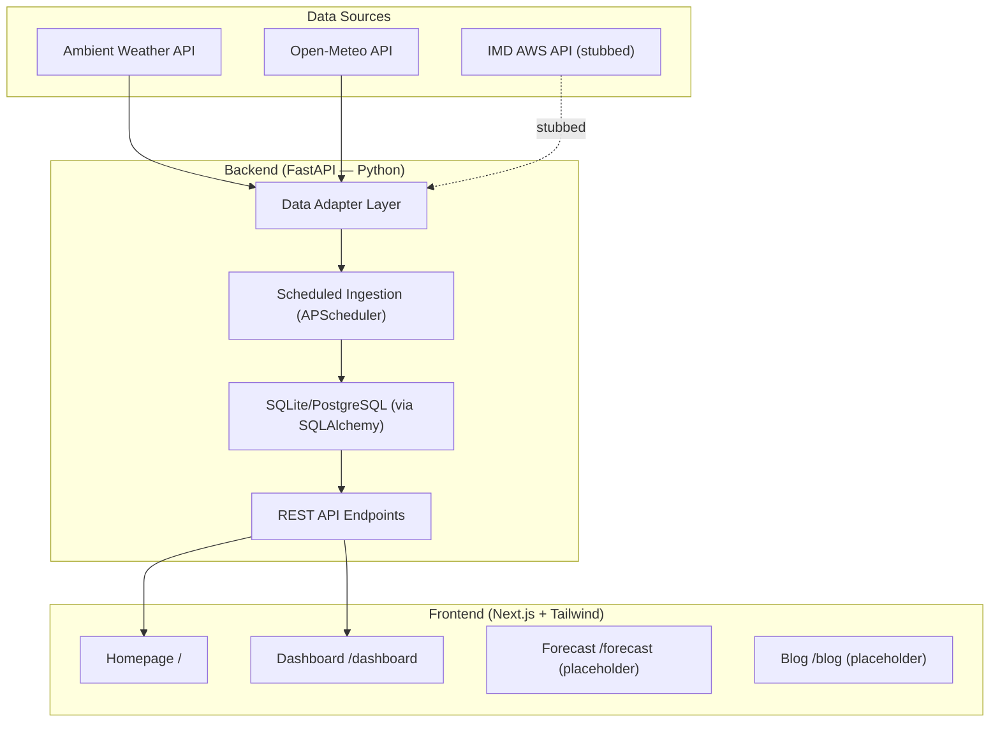

# Hyperlocal Rainfall Nowcasting — Phase 1 Implementation Plan

Build the full-stack foundation: FastAPI backend with data adapters, Next.js frontend with a stunning meteorological dashboard, and the ML pipeline scaffold — covering **Phase 1, Steps 1–4** from the project brief.

---

## Scope (This Build)

| Step | Description | Status |
|------|-------------|--------|
| P1-1 | Scaffold Next.js frontend + FastAPI backend, connected via REST API | 🔨 |
| P1-2 | Build data adapter interface + Ambient Weather API + Open-Meteo adapters | 🔨 |
| P1-3 | Set up scheduled ingestion job (every 10-15 min) writing to DB | 🔨 |
| P1-4 | Build homepage + live station cards + basic trend graphs | 🔨 |

Steps P1-5 (feature engineering) and P1-6 (baseline ML models) are **deferred** until this foundation is reviewed.

---

## Proposed Architecture



---

## Proposed Changes

### Backend — FastAPI (`/backend`)

#### [NEW] [main.py](file:///D:/FYP-1/backend/main.py)
FastAPI application entry point. Configures CORS, mounts API router, starts the APScheduler background ingestion job on startup.

#### [NEW] [config.py](file:///D:/FYP-1/backend/config.py)
Pydantic `Settings` class reading from `.env` — `AMBIENT_API_KEY`, `AMBIENT_APP_KEY`, `OPEN_METEO_BASE_URL`, `IMD_API_TOKEN`, `DATABASE_URL`.

#### [NEW] [database.py](file:///D:/FYP-1/backend/database.py)
SQLAlchemy async engine + session factory. Defaults to SQLite for local dev (`sqlite+aiosqlite:///./weather.db`), configurable to PostgreSQL for production.

#### [NEW] [models.py](file:///D:/FYP-1/backend/models.py)
SQLAlchemy ORM models: `WeatherReading`, `NowcastPrediction`, `Station`. Schema matches the brief exactly.

#### [NEW] [schemas.py](file:///D:/FYP-1/backend/schemas.py)
Pydantic response/request schemas for API serialization.

#### [NEW] [adapters/base.py](file:///D:/FYP-1/backend/adapters/base.py)
Abstract `WeatherAdapter` base class defining the source-agnostic interface: `async fetch_readings() -> list[WeatherReading]`. All adapters implement this.

#### [NEW] [adapters/ambient.py](file:///D:/FYP-1/backend/adapters/ambient.py)
Ambient Weather API adapter. Calls the REST API with `API_KEY` + `APP_KEY`, maps JSON response to the `WeatherReading` interface.

#### [NEW] [adapters/openmeteo.py](file:///D:/FYP-1/backend/adapters/openmeteo.py)
Open-Meteo adapter. Fetches current weather for configured Tamil Nadu/Puducherry coordinates. No API key required.

#### [NEW] [adapters/imd.py](file:///D:/FYP-1/backend/adapters/imd.py)
Stubbed IMD adapter. Implements the interface but raises `NotImplementedError` / returns empty list with a clear `# TODO: Implement when API access is approved` comment.

#### [NEW] [ingestion.py](file:///D:/FYP-1/backend/ingestion.py)
Scheduled ingestion service using APScheduler. Runs every 10 minutes, calls all active adapters, deduplicates by `(station_id, timestamp)`, and bulk-inserts into the DB.

#### [NEW] [routers/weather.py](file:///D:/FYP-1/backend/routers/weather.py)
API endpoints:
- `GET /api/stations` — list all stations with latest reading
- `GET /api/stations/{id}/readings` — time-series data for a station (with `?hours=N` query param)
- `GET /api/readings/latest` — latest readings for all stations
- `GET /api/nowcast/latest` — latest nowcast predictions (placeholder for Phase 2)

#### [MODIFY] [requirements.txt](file:///D:/FYP-1/backend/requirements.txt)
Full dependency list: `fastapi`, `uvicorn[standard]`, `sqlalchemy[asyncio]`, `aiosqlite`, `httpx`, `apscheduler`, `pydantic-settings`, `python-dotenv`.

#### [MODIFY] [.env.example](file:///D:/FYP-1/backend/.env.example)
Updated with all env vars from the brief.

---

### Frontend — Next.js (`/web-app`)

> [!IMPORTANT]
> The existing `/web-app` directory has stale config files but no source code. We will **re-scaffold** a fresh Next.js 14+ project with App Router, Tailwind CSS, and TypeScript.

#### [NEW] Next.js Project Scaffold
Initialize with `npx -y create-next-app@latest ./` using App Router + Tailwind + TypeScript. Then build out:

#### [NEW] [src/app/layout.tsx](file:///D:/FYP-1/web-app/src/app/layout.tsx)
Root layout with dark theme, Inter/JetBrains Mono fonts, ocean-teal color palette (`#065A82`, `#1C7293`, `#21295C`), global navigation bar.

#### [NEW] [src/app/page.tsx](file:///D:/FYP-1/web-app/src/app/page.tsx)
**Homepage** — Hero section with animated weather visualization, overview cards (active stations, latest rainfall, current conditions), "What is this project?" section, quick links to dashboard/forecast.

#### [NEW] [src/app/dashboard/page.tsx](file:///D:/FYP-1/web-app/src/app/dashboard/page.tsx)
**Live Dashboard** — Grid of station cards showing real-time weather data (temp, humidity, pressure, rainfall, wind). Each card is a glassmorphism panel with micro-animations. Trend chart section below using Recharts (temperature + rainfall line/bar combo chart for last 24h).

#### [NEW] [src/app/forecast/page.tsx](file:///D:/FYP-1/web-app/src/app/forecast/page.tsx)
**Forecast page** — Placeholder with "Coming in Phase 2" notice and design mockup for ECMWF maps.

#### [NEW] [src/app/blog/page.tsx](file:///D:/FYP-1/web-app/src/app/blog/page.tsx)
**Blog listing** — Placeholder with "Coming Soon" notice.

#### [NEW] [src/components/Navbar.tsx](file:///D:/FYP-1/web-app/src/components/Navbar.tsx)
Top navigation bar with logo, route links, dark theme toggle.

#### [NEW] [src/components/StationCard.tsx](file:///D:/FYP-1/web-app/src/components/StationCard.tsx)
Glassmorphism card component for a single weather station — shows temp, humidity, pressure, rainfall, wind speed with animated icons and color-coded values.

#### [NEW] [src/components/TrendChart.tsx](file:///D:/FYP-1/web-app/src/components/TrendChart.tsx)
Recharts-based line/bar combo chart for time-series weather data. Dark-themed, styled to match the ocean palette.

#### [NEW] [src/components/HeroWeather.tsx](file:///D:/FYP-1/web-app/src/components/HeroWeather.tsx)
Animated hero section with dynamic weather stats, particle effects or animated rain/cloud CSS.

#### [NEW] [src/lib/api.ts](file:///D:/FYP-1/web-app/src/lib/api.ts)
API client utility — typed functions to call the FastAPI backend (`fetchStations`, `fetchReadings`, `fetchLatest`).

#### [NEW] [src/lib/types.ts](file:///D:/FYP-1/web-app/src/lib/types.ts)
TypeScript type definitions matching the backend schemas.

---

### ML Pipeline (`/ml-pipeline`) — Scaffold Only

#### [MODIFY] [README.md](file:///D:/FYP-1/ml-pipeline/README.md)
Updated README with project structure documentation and Phase 1/2 roadmap.

#### [NEW] [src/feature_engineering.py](file:///D:/FYP-1/ml-pipeline/src/feature_engineering.py)
Placeholder script with documented plan for rolling pressure trends, humidity trends, dew point spread — will be fleshed out in P1-5.

---

## Design System

| Token | Value | Usage |
|-------|-------|-------|
| `--deep-blue` | `#065A82` | Primary backgrounds, headers |
| `--teal` | `#1C7293` | Accents, active states, links |
| `--midnight` | `#21295C` | Card backgrounds, nav bar |
| `--surface` | `#0A1628` | Page background |
| `--surface-card` | `rgba(10, 22, 40, 0.7)` | Glassmorphism card surfaces |
| `--text-primary` | `#E8F1F8` | Primary text |
| `--text-secondary` | `#8BA4B8` | Secondary/muted text |
| `--accent-rain` | `#00D4FF` | Rainfall indicators |
| `--accent-temp` | `#FF6B35` | Temperature indicators |
| `--accent-warn` | `#FFD166` | Warning states |

Fonts: **Inter** (UI), **JetBrains Mono** (data values/readings).

---

## Key Design Decisions

1. **SQLite for local dev** — No need to install PostgreSQL upfront. The `DATABASE_URL` env var switches to Postgres in production. TimescaleDB can be added later.
2. **APScheduler (in-process)** — Simpler than setting up Celery/Redis for Phase 1. The ingestion runs as a background task inside the FastAPI process. Can be extracted to a standalone cron job later.
3. **Open-Meteo as primary data source for now** — Since Ambient Weather API requires real API keys and IMD is pending, Open-Meteo (free, no key) provides immediate demo data for 6+ Tamil Nadu cities.
4. **Adapter pattern** — Strict interface means adding IMD later is a single file addition with zero downstream changes.

---

## Verification Plan

### Automated Tests
```bash
# Backend: run the FastAPI app
cd backend && pip install -r requirements.txt && uvicorn main:app --reload

# Frontend: run Next.js dev server  
cd web-app && npm install && npm run dev
```

### Manual Verification
- Backend `/api/stations` returns station data
- Backend `/api/readings/latest` returns current weather readings
- Frontend homepage loads with hero section and overview cards
- Frontend dashboard shows station cards populated from API
- Trend chart renders 24h data for a selected station
- Ingestion job fires every 10 minutes (visible in server logs)
- Dark mode renders correctly with the ocean-teal palette
