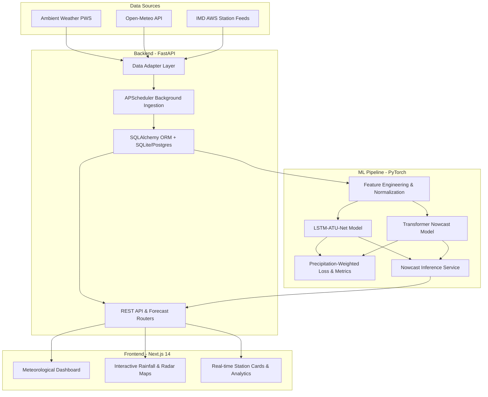

# Hyperlocal Rainfall Nowcasting System 🌧️⚡

> **Final Year Project (Phase 1)**  
> Developed by **Bharath B** ([@BharathB777](https://github.com/BharathB777))

An end-to-end meteorological nowcasting and weather intelligence platform that predicts high-resolution, hyperlocal precipitation using multi-source observational data, deep learning spatio-temporal architectures, an asynchronous FastAPI backend, and a Next.js meteorological dashboard.

---

## 📌 Project Overview

Traditional numerical weather prediction models often struggle with fine-grained, short-term precipitation events (0–6 hours) at hyper-localized urban scales. This system bridges that gap by:
1. **Multi-Source Ingestion**: Aggregating real-time data from Personal Weather Stations (Ambient Weather API), regional meteorological networks (Open-Meteo API), and official AWS feeds (IMD).
2. **Deep Learning Nowcasting**: Implementing custom spatio-temporal architectures including **LSTM-ATU-Net** (Attention U-Net with ConvLSTM) and **Spatio-Temporal Transformers** with custom precipitation-weighted loss functions (B-MSE, CSI, ETS).
3. **Interactive Visualization**: Providing meteorologists and citizens with real-time station cards, rainfall trends, animated radar/nowcast maps, and threshold alert monitoring.

---

## 🏛️ System Architecture



---

## 💻 Tech Stack

- **Frontend**: Next.js 14 (App Router), TypeScript, Tailwind CSS, Lucide Icons, Recharts, Leaflet/Mapbox
- **Backend**: Python 3.11+, FastAPI, Pydantic v2, SQLAlchemy (asyncio / aiosqlite), APScheduler, HTTPX
- **ML & Data Pipeline**: PyTorch, NumPy, Pandas, SciPy, Scikit-Learn
- **Database**: SQLite (local development) / PostgreSQL

---

## 📂 Repository Structure

```
FYP-1/
├── backend/                       # FastAPI application & ingestion engine
│   ├── adapters/                  # Weather data adapters (Ambient, Open-Meteo, IMD)
│   ├── routers/                   # API route handlers (stations, readings, forecast)
│   ├── config.py                  # Settings & environment variable loader
│   ├── database.py                # Async database engine & session factory
│   ├── ingestion.py               # Scheduled background data ingestion pipeline
│   ├── main.py                    # Application entry point & lifespan events
│   ├── models.py                  # SQLAlchemy ORM models
│   ├── schemas.py                 # Pydantic schemas & validation
│   └── requirements.txt           # Python dependencies
├── ml-pipeline/                   # Machine learning nowcasting pipeline
│   └── src/
│       ├── ecsa.py                # Extreme condition sensitivity analysis
│       ├── feature_engineering.py # Data preprocessing & sliding windows
│       ├── loss.py                # Balanced MSE & extreme precipitation loss
│       ├── lstmatu_net.py         # LSTM Attention U-Net model
│       ├── metrics.py             # CSI, ETS, FAR, POD meteorological metrics
│       ├── nowcast_service.py     # Inference service for runtime forecasts
│       ├── transformer_nowcast.py # Spatio-temporal transformer model
│       └── verify_models.py       # Model sanity checks and benchmarks
├── web-app/                       # Next.js 14 web application
│   ├── src/
│   │   ├── app/                   # App Router pages (forecast, dashboard, blog, etc.)
│   │   ├── components/            # UI components (maps, station cards, charts)
│   │   └── lib/                   # Utilities, API client, helper functions
│   ├── package.json
│   └── tsconfig.json
├── Literature survey papers/      # Phase 1 literature review and research publications
├── Phase 1 reports - Bharath/     # Formal college FYP Phase 1 documentation
├── Project brief.md               # Detailed phase breakdown & milestones
├── README.md                      # Project documentation
└── .gitignore                     # Git ignore rules
```

---

## 🚀 Getting Started

### 1. Clone the Repository
```bash
git clone https://github.com/BharathB777/Hyperlocal-Rainfall-Nowcasting.git
cd Hyperlocal-Rainfall-Nowcasting
```

### 2. Backend Setup (FastAPI)
```bash
cd backend
python -m venv venv
# Windows:
.\venv\Scripts\activate
# Linux/macOS:
source venv/bin/activate

pip install -r requirements.txt
cp .env.example .env

# Run FastAPI development server
uvicorn main:app --reload --port 8000
```
API Documentation will be live at `http://localhost:8000/docs`.

### 3. Frontend Setup (Next.js)
```bash
cd web-app
npm install
npm run dev
```
Open `http://localhost:3000` in your browser.

---

## 📜 License
This project is developed for academic research and Final Year Project (FYP) demonstration. All rights reserved.
